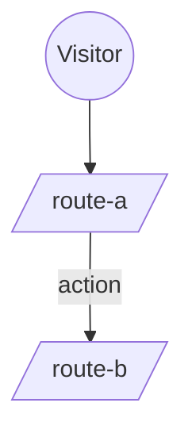

# Wireframes — [PRODUCT NAME] (fill-only template)

> **How to use (for `/spec` Phase 2.5):** copy this folder to `specs/wireframes/`, then fill the `[ … ]` placeholders. The **ASCII/Mermaid layer is always produced** (versioned source of truth). The **clickable HTML prototype (`prototype/index.html`) is opt-in (default OFF)** — fill it only when the user requests it or the stakeholder/PO needs to click through to sign off. Fidelity = **intent-level** (not pixel-perfect; tokens/components belong to `/arch`).
> ASCII rules: [`../../.claude/references/ascii-diagram-guide.md`](../../.claude/references/ascii-diagram-guide.md). Convention: [`../../.claude/agents/ui-ux-designer.md`](../../.claude/agents/ui-ux-designer.md).

## Sitemap (Mermaid)

## Index — screens

| Screen | File | User stories |
|---|---|---|
| [Screen name] | [screens/US-XXX-<slug>.md](screens/US-XXX-screen.template.md) | [US-XXX, …] |

## Index — flows

| Flow | File |
|---|---|
| [Flow name] | [flows/<flow>.md](flows/FLOW.template.md) |

## Shared design notes (apply to all screens)

- **Breakpoints:** [mobile-first; desktop ≥ Npx — fill from `rules/frontend.md`].
- **A11y (WCAG 2.1 AA):** semantic HTML; every input has `<label>`; icon-only buttons have `aria-label`; errors use `role="alert"`; contrast ≥ 4.5:1; `html lang="[xx]"`.
- **Error contract:** [field errors under input from `ProblemDetails.errors`; general errors as banner].
- **Mandatory list states:** `empty · loading · error · no-result`.
- **Session/auth:** [e.g. token survives reload — describe if relevant].
